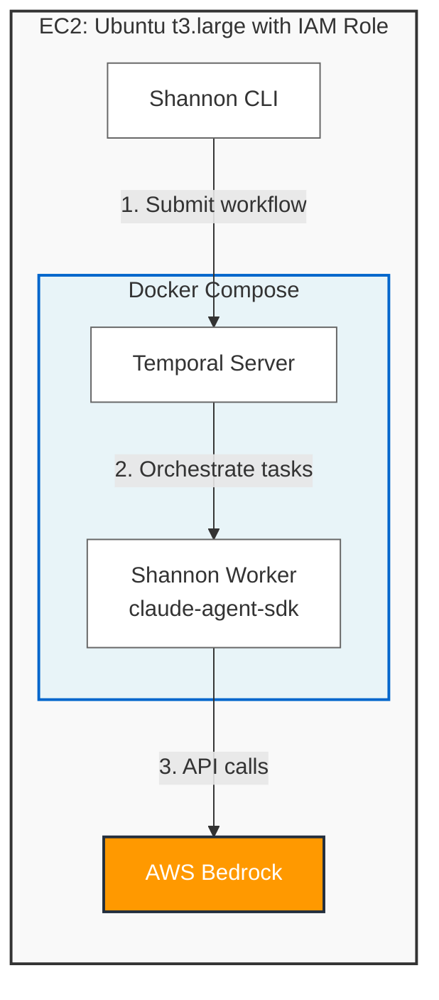

# Shannon + AWS Bedrock Deployment Guide

> **[Korean version (한국어 버전)](./SHANNON_BEDROCK_GUIDE_KR.md)**

> **Warning: This guide is intended for authorized security testing only.**
> Only use on systems you own or have explicit permission to test.
> Unauthorized penetration testing is illegal.

This guide covers running the Shannon AI penetration testing framework on AWS Bedrock, deployed on EC2.

> Shannon upstream: https://github.com/KeygraphHQ/shannon

> **Shannon Lite is whitebox-only (source code required).**
> Shannon needs access to the target application's source code.
> If the `repos/<name>/` directory is empty, the pre-recon agent will fail.
> Blackbox testing (URL-only, no source) is not supported.

## Architecture



### How It Works

EC2 runs Docker Compose which starts two containers (Temporal + Worker).
Shannon code runs inside the Worker container. The environment variable flow is:

```
EC2 host (.env) → docker-compose.yml environment → Worker container → spawned cli.js
```

1. Shannon uses `@anthropic-ai/claude-agent-sdk`
2. The SDK's `query()` function spawns the bundled `cli.js` (Claude Code) via `child_process.spawn()`
3. Shannon's executor (`claude-executor.ts`) does not explicitly pass `env` to the SDK, so **the Worker container's environment variables are inherited by the CLI process as-is**
4. Claude Code (`cli.js`) detects `CLAUDE_CODE_USE_BEDROCK=1` and enters Bedrock mode
5. `cli.js` already bundles `@aws-sdk/credential-providers`, so no extra packages are needed

### Pre-applied Patches

This repo includes Bedrock support patches already applied:

| File | Patch |
|------|-------|
| `docker-compose.yml` | Removed `ANTHROPIC_API_KEY`, `ANTHROPIC_BASE_URL`, `ANTHROPIC_AUTH_TOKEN` from worker. Added Bedrock/AWS env vars |
| `shannon` | Added Bedrock mode bypass for API key validation |
| `src/ai/claude-executor.ts` | Changed hardcoded model to `process.env.ANTHROPIC_MODEL \|\| 'claude-sonnet-4-5-20250929'` |

---

## Prerequisites

- **Local machine** (macOS, Linux, or Windows with WSL) with AWS CLI installed and configured
- AWS CLI installed and configured with appropriate credentials
- Bedrock Claude model access enabled in your AWS account (us-east-1 region)
- **Target application source code** (to be uploaded to S3 as tar.gz)

---

## Quick Start: One-Click Deployment (`deploy-shannon.sh`)

### Step 0: Clone This Repository (on your local machine)

The `deploy-shannon.sh` script is included in this repository and must be run from your **local machine** (not from EC2).

```bash
# Clone the Shannon repository to your local machine
git clone https://github.com/Frangke/shannon-bedrock.git
cd shannon-bedrock

# Verify the deployment script exists
ls -l deploy-shannon.sh
```

### How It Works

`deploy-shannon.sh` automates the entire flow: IAM Role creation → EC2 launch → Shannon setup → execution.

### Step 1: Upload Target Application Source Code to S3

**Important:** Shannon framework code is automatically cloned from GitHub during deployment.
You only need to upload your **target application's source code** (the app you want to test) to S3.

Package your target application source code and upload it to S3.

```bash
# Package source code
cd /path/to/target-source
tar czf /tmp/vuln-site-src.tar.gz .

# Upload to S3
aws s3 cp /tmp/vuln-site-src.tar.gz s3://your-bucket/vuln-site-src.tar.gz --region us-east-1
```

> On macOS, use `COPYFILE_DISABLE=1 tar czf ...` to avoid `._` prefix metadata files.

### Step 2: Deploy

```bash
./deploy-shannon.sh \
  --github-repo Frangke/shannon-bedrock \
  --target-url https://target-site.com \
  --s3-source s3://your-bucket/vuln-site-src.tar.gz
```

What the script does automatically:

| Phase | Description |
|-------|-------------|
| **Phase 1** | Create IAM Role (SSM + Bedrock + S3 permissions), launch EC2 instance, wait for ready |
| **Phase 2** | Wait for Docker installation, **clone Shannon from GitHub**, create .env, **download target app source from S3**, set permissions |
| **Phase 3** | Run `./shannon start`, capture workflow ID |
| **Phase 4** | Output workflow ID, monitoring commands, download instructions |

#### Parameters

| Parameter | Required | Default | Description |
|-----------|----------|---------|-------------|
| `--github-repo` | Yes | - | GitHub repository (e.g. `Frangke/shannon-bedrock`) |
| `--github-branch` | No | `main` | Branch to clone |
| `--target-url` | Yes | - | Pentest target URL |
| `--s3-source` | Yes | - | Target source code S3 path (tar.gz) |
| `--repo-name` | No | Extracted from S3 filename | Folder name under repos/ |
| `--model` | No | `us.anthropic.claude-sonnet-4-20250514-v1:0` | Bedrock model ID |
| `--region` | No | `us-east-1` | AWS region |
| `--instance-type` | No | `t3.large` | EC2 instance type |
| `--instance-id` | No | - | Reuse existing EC2 (skips Phase 1) |
| `--teardown` | No | - | Teardown mode |

#### Reusing an Existing Instance

If you already have an EC2 instance, use `--instance-id` to skip Phase 1:

```bash
./deploy-shannon.sh \
  --github-repo Frangke/shannon-bedrock \
  --target-url https://target-site.com \
  --s3-source s3://your-bucket/vuln-site-src.tar.gz \
  --instance-id i-0abc123def456
```

### Step 3: Monitor

Use the commands printed at deployment completion:

```bash
# Connect via SSM
aws ssm start-session --target <instance-id> --region us-east-1

# Switch to ubuntu user
sudo su - ubuntu
cd ~/shannon

# View logs
./shannon logs ID=<workflow-id>
./shannon query ID=<workflow-id>

# Temporal Web UI (port forwarding)
aws ssm start-session --target <instance-id> --region us-east-1 \
  --document-name AWS-StartPortForwardingSession \
  --parameters '{"portNumber":["8233"],"localPortNumber":["8233"]}'
# Open http://localhost:8233 in your browser
```

### Step 4: Download Results

Shannon saves results to `repos/<name>/deliverables/`.

```bash
# Inside EC2 (SSM session)
sudo su - ubuntu && cd ~/shannon
tar czf /tmp/shannon-results.tar.gz audit-logs/ repos/*/deliverables/
aws s3 cp /tmp/shannon-results.tar.gz s3://your-bucket/shannon-results.tar.gz

# From local machine
aws s3 cp s3://your-bucket/shannon-results.tar.gz ./shannon-results.tar.gz
tar xzf shannon-results.tar.gz
```

### Step 5: Teardown

```bash
./deploy-shannon.sh --teardown --instance-id <instance-id> --region us-east-1
```

Terminates the EC2 instance and deletes the IAM Role/Instance Profile.

---

## Manual Deployment (Reference)

Step-by-step instructions without the automated script.

### 1. Create IAM Role (SSM + Bedrock)

```bash
cat > /tmp/ec2-trust.json << 'EOF'
{
  "Version": "2012-10-17",
  "Statement": [
    {
      "Effect": "Allow",
      "Principal": { "Service": "ec2.amazonaws.com" },
      "Action": "sts:AssumeRole"
    }
  ]
}
EOF

aws iam create-role \
  --role-name shannon-ec2-bedrock-role \
  --assume-role-policy-document file:///tmp/ec2-trust.json \
  --no-cli-pager

aws iam attach-role-policy \
  --role-name shannon-ec2-bedrock-role \
  --policy-arn arn:aws:iam::aws:policy/AmazonSSMManagedInstanceCore

aws iam put-role-policy \
  --role-name shannon-ec2-bedrock-role \
  --policy-name bedrock-invoke \
  --policy-document '{
    "Version": "2012-10-17",
    "Statement": [
      {
        "Effect": "Allow",
        "Action": [
          "bedrock:InvokeModel",
          "bedrock:InvokeModelWithResponseStream"
        ],
        "Resource": "arn:aws:bedrock:us-east-1::foundation-model/*"
      }
    ]
  }'

aws iam create-instance-profile \
  --instance-profile-name shannon-ec2-bedrock-profile
aws iam add-role-to-instance-profile \
  --instance-profile-name shannon-ec2-bedrock-profile \
  --role-name shannon-ec2-bedrock-role

echo "Waiting for IAM propagation (15s)..."
sleep 15
```

### 2. Launch EC2 Instance

```bash
UBUNTU_AMI=$(aws ec2 describe-images \
  --region us-east-1 --owners 099720109477 \
  --filters "Name=name,Values=ubuntu/images/hvm-ssd-gp3/ubuntu-noble-24.04-amd64-server-*" \
            "Name=state,Values=available" \
  --query 'sort_by(Images, &CreationDate)[-1].ImageId' --output text)

INSTANCE_ID=$(aws ec2 run-instances \
  --region us-east-1 \
  --image-id $UBUNTU_AMI \
  --instance-type t3.large \
  --iam-instance-profile Name=shannon-ec2-bedrock-profile \
  --block-device-mappings '[{"DeviceName":"/dev/sda1","Ebs":{"VolumeSize":30,"VolumeType":"gp3"}}]' \
  --tag-specifications 'ResourceType=instance,Tags=[{Key=Name,Value=shannon-pentest}]' \
  --metadata-options "HttpTokens=required,HttpPutResponseHopLimit=2,HttpEndpoint=enabled" \
  --user-data '#!/bin/bash
sed -i "s/Unattended-Upgrade::Automatic-Reboot \"true\"/Unattended-Upgrade::Automatic-Reboot \"false\"/" /etc/apt/apt.conf.d/50unattended-upgrades 2>/dev/null || true
apt-get update
apt-get install -y ca-certificates curl gnupg git
install -m 0755 -d /etc/apt/keyrings
curl -fsSL https://download.docker.com/linux/ubuntu/gpg | gpg --dearmor -o /etc/apt/keyrings/docker.gpg
chmod a+r /etc/apt/keyrings/docker.gpg
echo "deb [arch=$(dpkg --print-architecture) signed-by=/etc/apt/keyrings/docker.gpg] https://download.docker.com/linux/ubuntu $(. /etc/os-release && echo $VERSION_CODENAME) stable" > /etc/apt/sources.list.d/docker.list
apt-get update
apt-get install -y docker-ce docker-ce-cli containerd.io docker-buildx-plugin docker-compose-plugin
systemctl enable docker
systemctl start docker
usermod -aG docker ubuntu
' \
  --query 'Instances[0].InstanceId' --output text)

echo "Instance ID: $INSTANCE_ID"
aws ec2 wait instance-status-ok --instance-ids $INSTANCE_ID --region us-east-1
```

### 3. Connect and Configure Shannon

```bash
aws ssm start-session --target $INSTANCE_ID --region us-east-1
```

After connecting:

```bash
sudo su - ubuntu

# Clone Shannon
git clone https://github.com/Frangke/shannon-bedrock.git ~/shannon
cd ~/shannon

# Create .env (fetch credentials from IMDSv2)
TOKEN=$(curl -s -X PUT "http://169.254.169.254/latest/api/token" \
  -H "X-aws-ec2-metadata-token-ttl-seconds: 21600")
ROLE_NAME=$(curl -s -H "X-aws-ec2-metadata-token: $TOKEN" \
  http://169.254.169.254/latest/meta-data/iam/security-credentials/)
CREDS=$(curl -s -H "X-aws-ec2-metadata-token: $TOKEN" \
  http://169.254.169.254/latest/meta-data/iam/security-credentials/$ROLE_NAME)

AWS_ACCESS_KEY_ID=$(echo $CREDS | python3 -c "import sys,json; print(json.load(sys.stdin)['AccessKeyId'])")
AWS_SECRET_ACCESS_KEY=$(echo $CREDS | python3 -c "import sys,json; print(json.load(sys.stdin)['SecretAccessKey'])")
AWS_SESSION_TOKEN=$(echo $CREDS | python3 -c "import sys,json; print(json.load(sys.stdin)['Token'])")

cat > .env << EOF
CLAUDE_CODE_USE_BEDROCK=1
CLAUDE_CODE_MAX_OUTPUT_TOKENS=64000
AWS_REGION=us-east-1
ANTHROPIC_MODEL=us.anthropic.claude-sonnet-4-20250514-v1:0
AWS_ACCESS_KEY_ID=$AWS_ACCESS_KEY_ID
AWS_SECRET_ACCESS_KEY=$AWS_SECRET_ACCESS_KEY
AWS_SESSION_TOKEN=$AWS_SESSION_TOKEN
EOF
```

> **Never** add `ANTHROPIC_API_KEY` to `.env`.
> IMDS temporary credentials expire. If you get auth errors, re-run the above commands to refresh `.env`.

### 4. Deploy Source Code and Run

```bash
# Download source from S3
mkdir -p repos/vuln-site
aws s3 cp s3://your-bucket/vuln-site-src.tar.gz /tmp/
tar xzf /tmp/vuln-site-src.tar.gz -C repos/vuln-site/

# Set permissions (required!)
chmod -R 777 repos/vuln-site/

# Run
./shannon start URL=https://target-site.com REPO=vuln-site
```

### 5. Cleanup

```bash
aws ec2 terminate-instances --instance-ids $INSTANCE_ID --region us-east-1

aws iam remove-role-from-instance-profile \
  --instance-profile-name shannon-ec2-bedrock-profile \
  --role-name shannon-ec2-bedrock-role
aws iam delete-instance-profile \
  --instance-profile-name shannon-ec2-bedrock-profile
aws iam delete-role-policy \
  --role-name shannon-ec2-bedrock-role \
  --policy-name bedrock-invoke
aws iam detach-role-policy \
  --role-name shannon-ec2-bedrock-role \
  --policy-arn arn:aws:iam::aws:policy/AmazonSSMManagedInstanceCore
aws iam delete-role \
  --role-name shannon-ec2-bedrock-role
```

---

## Deliverables

### File Location

> Shannon saves results to `repos/<name>/deliverables/`.
> The `audit-logs/` folder only contains session metadata, agent logs, and prompt snapshots.

```bash
ls ~/shannon/repos/vuln-site/deliverables/
```

### Generated Files

| File | Description | Agent |
|------|-------------|-------|
| `comprehensive_security_assessment_report.md` | **Final security assessment report** | report |
| `code_analysis_deliverable.md` | Static source code analysis | pre-recon |
| `recon_deliverable.md` | Reconnaissance (endpoints, infra) | recon |
| `injection_analysis_deliverable.md` | SQL/Command injection analysis | injection-vuln |
| `injection_exploitation_evidence.md` | Injection exploit evidence (with PoC) | injection-exploit |
| `xss_analysis_deliverable.md` | XSS vulnerability analysis | xss-vuln |
| `xss_exploitation_evidence.md` | XSS exploit evidence (with PoC) | xss-exploit |
| `auth_analysis_deliverable.md` | Authentication vulnerability analysis | auth-vuln |
| `auth_exploitation_evidence.md` | Auth exploit evidence (with PoC) | auth-exploit |
| `authz_analysis_deliverable.md` | Authorization vulnerability analysis | authz-vuln |
| `authz_exploitation_evidence.md` | Authorization exploit evidence (with PoC) | authz-exploit |
| `ssrf_analysis_deliverable.md` | SSRF analysis | ssrf-vuln |

> Exploit agents are automatically skipped if no vulnerabilities are found.

### Cost Reference

| Model | Estimated Duration | Estimated Cost |
|-------|-------------------|----------------|
| Claude Sonnet 4 (us.anthropic) | ~1.5 hours | ~$23 |
| Claude Sonnet 4.5 | ~1.5 hours | ~$50 |

> Costs vary depending on target application complexity.

---

## `ANTHROPIC_MODEL` Reference

Available Bedrock Claude models for Shannon deployment:

| Model ID | Model | Region Type | Notes |
|----------|-------|-------------|-------|
| `us.anthropic.claude-sonnet-4-20250514-v1:0` | Claude Sonnet 4 | Single region (`us.`) | No CRIS setup required |
| `us.anthropic.claude-sonnet-4-5-20250929-v1:0` | Claude Sonnet 4.5 | Single region (`us.`) | No CRIS setup required |
| `global.anthropic.claude-sonnet-4-5-20250929-v1:0` | Claude Sonnet 4.5 | Global routing | Requires CRIS activation in AWS Console |
| `us.anthropic.claude-opus-4-20250514-v1:0` | Claude Opus 4 | Single region (`us.`) | Higher cost, best reasoning capability |
| `us.anthropic.claude-haiku-4-5-20251001-v1:0` | Claude Haiku 4.5 | Single region (`us.`) | Lower cost, faster but less capable |

**Prefix Explanation:**
- `us.` prefix: Routes to a single AWS region, works without additional setup
- `global.` prefix: Uses Cross-Region Inference (CRIS), must be enabled in AWS Console > Bedrock > Model access

**Model Selection:**
Choose based on your testing needs and budget. Verify the model is enabled in your AWS account's Bedrock model access settings before deployment.

---

## Technical Reference

### cli.js Model Selection Flow

```
Model selection (sl → jE function):
├─ A71(): check query()'s model parameter → use if present (highest priority)
├─ process.env.ANTHROPIC_MODEL → use if set
└─ fallback → default mapping:
    ├─ bedrock provider: dZ0.bedrock = "global.anthropic.claude-sonnet-4-5-20250929-v1:0"
    └─ global. prefix → requires Cross-Region Inference (CRIS)
```

> `claude-executor.ts` passes `process.env.ANTHROPIC_MODEL` to `query({ model: ... })`, so the `.env` value takes highest priority.

### cli.js Bedrock Authentication Flow

```
J$ function (client creation):
├─ check CLAUDE_CODE_USE_BEDROCK=1
├─ call oA1() → no settings in Docker → null
├─ fallback: create new AnthropicBedrock(F)
│   └─ on request: fromNodeProviderChain() (bundled)
│       └─ fromEnv() → reads process.env.AWS_ACCESS_KEY_ID
└─ SigV4 sign → Bedrock API call
```

### Environment Variable Warnings

| Variable | Warning |
|----------|---------|
| `ANTHROPIC_API_KEY` | **Never set this.** Even an empty string (`""`) causes `cli.js` to use the Anthropic API instead of Bedrock. |
| `ANTHROPIC_AUTH_TOKEN` | **Do not set in worker.** Conflicts with SigV4 signing. |
| `ANTHROPIC_BASE_URL` | **Do not set in worker.** Overrides the Bedrock endpoint. |

> These three variables have already been removed from the worker section in this repo's `docker-compose.yml`.
> The router service's `ANTHROPIC_API_KEY` is kept since it's a separate service.

---

## Troubleshooting

### 403 Authorization header requires 'Credential' parameter

A request reached the Bedrock API without SigV4 signing.

**Check in order:**

1. **Verify `ANTHROPIC_API_KEY` is not set in the container**
   ```bash
   docker compose exec worker node -e "console.log('ANTHROPIC_API_KEY:', JSON.stringify(process.env.ANTHROPIC_API_KEY))"
   ```
   Must be `undefined`. Even `""` (empty string) causes issues.

2. **Verify `ANTHROPIC_AUTH_TOKEN` and `ANTHROPIC_BASE_URL` are not set**
   ```bash
   docker compose exec worker node -e "
     console.log('AUTH_TOKEN:', JSON.stringify(process.env.ANTHROPIC_AUTH_TOKEN));
     console.log('BASE_URL:', JSON.stringify(process.env.ANTHROPIC_BASE_URL));
   "
   ```
   Both must be `undefined`.

3. **Verify AWS credentials are passed to the container**
   ```bash
   docker compose exec worker node -e "
     console.log('AWS_ACCESS_KEY_ID:', process.env.AWS_ACCESS_KEY_ID?.substring(0,8));
     console.log('AWS_SECRET_ACCESS_KEY:', process.env.AWS_SECRET_ACCESS_KEY ? 'SET' : 'MISSING');
     console.log('AWS_SESSION_TOKEN:', process.env.AWS_SESSION_TOKEN ? 'SET' : 'MISSING');
     console.log('AWS_REGION:', process.env.AWS_REGION);
     console.log('CLAUDE_CODE_USE_BEDROCK:', process.env.CLAUDE_CODE_USE_BEDROCK);
   "
   ```

### 400 The provided model identifier is invalid

`cli.js` is calling the Bedrock API with an invalid model ID.

**Cause:** If `ANTHROPIC_MODEL` is not set, the default `global.anthropic.claude-sonnet-4-5-20250929-v1:0` is used. This requires CRIS to be enabled.

**Fix:**
1. Verify `.env` has `ANTHROPIC_MODEL=us.anthropic.claude-sonnet-4-20250514-v1:0`
2. Verify `docker-compose.yml` passes `ANTHROPIC_MODEL` to the worker
3. Restart with `REBUILD=true` after changes (TypeScript rebuild needed)

```bash
docker compose exec worker env | grep ANTHROPIC_MODEL
```

### Common Issues

| Problem | Solution |
|---------|----------|
| `Activity task failed` (pre-recon) | **Verify source code exists in `repos/<name>/`.** Shannon is whitebox-only; empty directories cause failures |
| `docker: permission denied` | `newgrp docker` or reconnect |
| `Cannot connect to Docker daemon` | `sudo systemctl start docker` |
| `ERROR: Set ANTHROPIC_API_KEY` | Verify `CLAUDE_CODE_USE_BEDROCK=1` is set in `.env` |
| `Repository not found at ./repos/...` | `mkdir -p repos/<name>` |
| `AccessDeniedException` | Verify IAM Role has `bedrock:InvokeModel` permission |
| Model access denied | Enable Claude models in AWS Console > Bedrock > Model access |
| Auth failure (mid-run) | IMDS temporary credentials expired. Re-fetch and restart |
| Unexpected reboot during build | Ubuntu auto security updates. Check user-data has `Automatic-Reboot "false"` |
| Docker build `permission denied` (audit-logs) | `sudo chown -R ubuntu:docker audit-logs && sudo chmod -R 755 audit-logs` then restart |
| `Validation failed: Missing required deliverable files` | `chmod -R 777 repos/<name>/` then restart |
