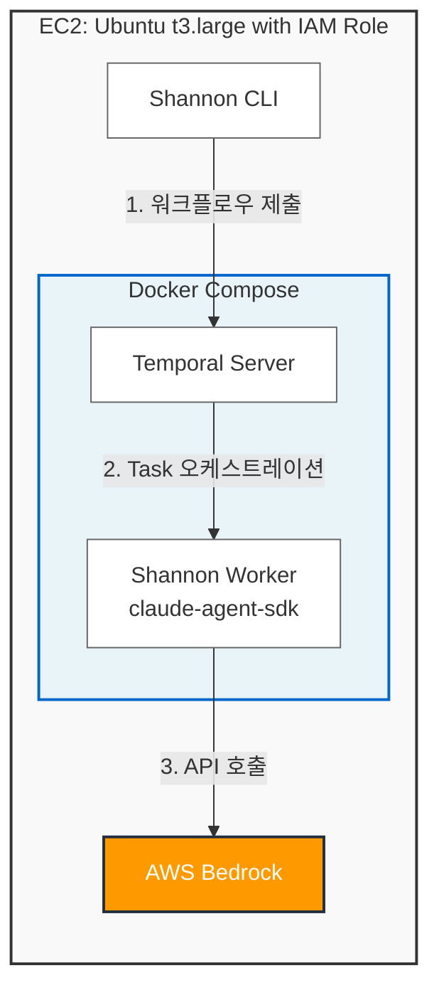

# Shannon + AWS Bedrock 실행 가이드

> **[English version](./SHANNON_BEDROCK_GUIDE.md)**

> **경고: 이 가이드는 내부 보안 테스트 전용입니다.**
> 본인이 소유하거나 명시적으로 테스트 허가를 받은 시스템에만 사용하세요.
> 허가 없이 타인의 시스템에 펜테스트를 수행하는 것은 불법입니다.

Shannon AI 펜테스트 프레임워크를 AWS Bedrock으로 동작하도록 설정하고, EC2에서 실행하는 가이드입니다.

> Shannon 원본: https://github.com/KeygraphHQ/shannon

> **Shannon Lite는 화이트박스(소스코드 기반) 전용입니다.**
> Shannon은 타겟 애플리케이션의 소스코드에 접근할 수 있어야 합니다.
> `repos/<name>/` 디렉토리에 소스코드가 없으면 pre-recon 에이전트가 빈 디렉토리를 분석하다 실패합니다.
> 블랙박스(소스코드 없이 URL만으로) 테스트는 지원하지 않습니다.

## 아키텍처 개요



### 핵심 동작 원리

EC2에서 Docker Compose로 컨테이너(Temporal + Worker)를 실행합니다.
Shannon 코드는 Worker 컨테이너 안에서 동작하며, 환경변수 흐름은 다음과 같습니다:

```
EC2 호스트 (.env) → docker-compose.yml environment → Worker 컨테이너 → spawn된 cli.js
```

1. Shannon은 `@anthropic-ai/claude-agent-sdk`를 사용
2. SDK의 `query()` 함수가 번들된 `cli.js`(Claude Code)를 `child_process.spawn()`으로 실행
3. Shannon의 executor(`claude-executor.ts`)는 SDK에 `env`를 명시적으로 전달하지 않으므로, **Worker 컨테이너의 환경변수가 그대로 CLI 프로세스에 상속**됨
4. Claude Code(`cli.js`)는 `CLAUDE_CODE_USE_BEDROCK=1` 환경변수를 감지하여 Bedrock 모드로 진입
5. `cli.js`에 `@aws-sdk/credential-providers`가 이미 번들링되어 있어 별도 패키지 설치 불필요

### 프리패치 상태

이 fork에는 Bedrock 지원을 위한 소스 패치가 이미 적용되어 있습니다:

| 파일 | 패치 내용 |
|------|-----------|
| `docker-compose.yml` | worker에서 `ANTHROPIC_API_KEY`, `ANTHROPIC_BASE_URL`, `ANTHROPIC_AUTH_TOKEN` 삭제. Bedrock/AWS 환경변수 추가 |
| `shannon` | API 키 검증에 Bedrock 모드 바이패스 추가 |
| `src/ai/claude-executor.ts` | 하드코딩된 모델명을 `process.env.ANTHROPIC_MODEL \|\| 'claude-sonnet-4-5-20250929'`로 변경 |

---

## 사전 요구사항

- **로컬 머신** (macOS, Linux, 또는 Windows with WSL)
- AWS CLI 설치 및 적절한 자격 증명으로 설정 완료
- AWS 계정에 Bedrock Claude 모델 접근 권한 활성화 (us-east-1 리전)
- **타겟 애플리케이션의 소스코드** (S3에 tar.gz로 업로드 예정)

---

## Quick Start: 원클릭 배포 (`deploy-shannon.sh`)

### Step 0: 저장소 클론 (로컬 머신에서)

`deploy-shannon.sh` 스크립트는 이 저장소에 포함되어 있으며, **로컬 머신**에서 실행해야 합니다 (EC2가 아님).

```bash
# Shannon 저장소를 로컬 머신에 클론
git clone https://github.com/Frangke/shannon-bedrock.git
cd shannon-bedrock

# 배포 스크립트가 존재하는지 확인
ls -l deploy-shannon.sh
```

### 동작 방식

`deploy-shannon.sh` 스크립트 하나로 IAM Role 생성 → EC2 생성 → Shannon 설치 → 실행까지 모두 자동화합니다.

### Step 1: 타겟 애플리케이션 소스코드 S3 업로드

**중요:** Shannon 프레임워크 코드는 배포 시 GitHub에서 자동으로 clone됩니다.
사용자는 **테스트할 대상 애플리케이션의 소스코드만** S3에 업로드하면 됩니다.

타겟 애플리케이션의 소스코드를 tar.gz로 묶어 S3에 업로드합니다.

```bash
# 소스코드를 tar.gz로 묶기
cd /path/to/target-source
tar czf /tmp/vuln-site-src.tar.gz .

# S3에 업로드
aws s3 cp /tmp/vuln-site-src.tar.gz s3://your-bucket/vuln-site-src.tar.gz --region us-east-1
```

> macOS에서 `._` prefix 파일이 포함되는 게 신경 쓰인다면 `COPYFILE_DISABLE=1 tar czf ...` 사용.

### Step 2: 배포 실행

```bash
./deploy-shannon.sh \
  --github-repo Frangke/shannon-bedrock \
  --target-url https://target-site.com \
  --s3-source s3://your-bucket/vuln-site-src.tar.gz
```

스크립트가 자동으로 수행하는 작업:

| Phase | 내용 |
|-------|------|
| **Phase 1** | IAM Role 생성 (SSM + Bedrock + S3 권한), EC2 인스턴스 생성, 준비 대기 |
| **Phase 2** | Docker 설치 대기, **GitHub에서 Shannon clone**, .env 생성, **S3에서 타겟 앱 소스 다운로드**, 권한 설정 |
| **Phase 3** | `./shannon start` 실행, 워크플로우 ID 캡처 |
| **Phase 4** | 결과 출력 (워크플로우 ID, 모니터링 명령어, 다운로드 명령어) |

#### 전체 파라미터

| 파라미터 | 필수 | 기본값 | 설명 |
|---------|------|--------|------|
| `--github-repo` | O | - | GitHub 저장소 (예: `Frangke/shannon-bedrock`) |
| `--github-branch` | X | `main` | clone할 브랜치명 |
| `--target-url` | O | - | 펜테스트 대상 URL |
| `--s3-source` | O | - | 타겟 소스코드 S3 경로 (tar.gz) |
| `--repo-name` | X | S3 파일명에서 추출 | repos/ 하위 폴더명 |
| `--model` | X | `us.anthropic.claude-sonnet-4-5-20250929-v1:0` | Bedrock 모델 ID |
| `--region` | X | `us-east-1` | AWS 리전 |
| `--instance-type` | X | `t3.large` | EC2 인스턴스 타입 |
| `--instance-id` | X | - | 기존 EC2 재사용 시 인스턴스 ID (Phase 1 스킵) |
| `--teardown` | X | - | 리소스 정리 모드 |

#### 기존 인스턴스 재사용

이미 생성된 EC2가 있으면 `--instance-id`로 Phase 1을 건너뛸 수 있습니다.

```bash
./deploy-shannon.sh \
  --github-repo Frangke/shannon-bedrock \
  --target-url https://target-site.com \
  --s3-source s3://your-bucket/vuln-site-src.tar.gz \
  --instance-id i-0abc123def456
```

---

## 예상 소요 시간

전체 배포 및 펜테스트 완료까지 **약 1.5~2시간** 소요됩니다.

| 단계 | 소요 시간 | 설명 |
|------|-----------|------|
| **Phase 1: AWS Infrastructure** | 2~3분 | IAM Role 생성, EC2 인스턴스 생성, 인스턴스 상태 체크 |
| **Phase 2: Shannon Setup** | 2~3분 | Docker/AWS CLI 설치 완료 대기, Git clone, S3 다운로드 |
| **Phase 3: Docker Build** | 5~10분 | 첫 실행 시 Temporal + Worker 이미지 빌드 (이후 캐시 사용) |
| **Phase 4: Pre-Reconnaissance** | 10~15분 | 외부 도구 스캔 (nmap, subfinder, whatweb) + 소스코드 분석 |
| **Phase 5: Reconnaissance** | 5~10분 | 초기 분석 결과 종합 |
| **Phase 6: Vulnerability Analysis** | 20~30분 | 5개 병렬 에이전트 (injection, XSS, auth, authz, SSRF) |
| **Phase 7: Exploitation** | 20~30분 | 취약점 발견 시 실제 PoC 공격 실행 (병렬) |
| **Phase 8: Reporting** | 10~15분 | 경영진 수준 종합 보고서 생성 |

> **참고:**
> - 타겟 애플리케이션의 규모와 복잡도에 따라 시간이 달라질 수 있습니다
> - Phase 6과 7은 취약점 발견 수에 따라 시간이 증가할 수 있습니다
> - Docker 이미지가 이미 빌드되어 있으면 Phase 3는 1분 이내로 단축됩니다

---

## 예상 비용

### AWS 리소스 비용

| 항목 | 사양 | 시간당 비용 | 예상 비용 (2시간) |
|------|------|-------------|------------------|
| **EC2 Instance** | t3.large (us-east-1) | $0.0832/hour | **$0.17** |
| **EBS Volume** | 30GB gp3 | $0.08/GB-month (~$0.0001/GB-hour) | **$0.006** |
| **Data Transfer** | S3 → EC2 (무료), 인터넷 송신 (소량) | - | **~$0.01** |

**EC2 총 비용: 약 $0.19 (~₩260)**

### Bedrock API 비용 (Claude Sonnet 4.5)

> 가격 기준: `us.anthropic.claude-sonnet-4-5-20250929-v1:0` (us-east-1)
> - Input: $0.003 / 1K tokens
> - Output: $0.015 / 1K tokens

**예상 토큰 사용량 (OWASP Juice Shop 기준):**

> **비용 산정 기준:** [OWASP Juice Shop](https://github.com/juice-shop/juice-shop) - Node.js/Express 기반의 중형 웹 애플리케이션 (약 10,000 LOC)을 대상으로 측정한 실제 실행 결과입니다.

| Phase | Input Tokens | Output Tokens | 비용 |
|-------|--------------|---------------|------|
| Pre-Reconnaissance | ~200K | ~50K | $1.35 |
| Reconnaissance | ~150K | ~30K | $0.90 |
| Vulnerability Analysis (5 agents) | ~500K | ~100K | $3.00 |
| Exploitation (5 agents) | ~400K | ~80K | $2.40 |
| Reporting | ~300K | ~60K | $1.80 |
| **총합** | **~1,550K** | **~320K** | **$9.45** |

### 모델별 비용 비교

| 모델 | Input 가격 | Output 가격 | 예상 총 비용 (동일 토큰) | 속도 |
|------|-----------|------------|----------------------|------|
| **Claude Sonnet 4.5** | $0.003 | $0.015 | **$9.45** | 빠름 |
| Claude Sonnet 4 | $0.003 | $0.015 | $9.45 | 보통 |
| Claude Opus 4 | $0.015 | $0.075 | $47.25 | 느림 |
| Claude Haiku 4.5 | $0.0008 | $0.004 | $2.52 | 매우 빠름 |

### 총 예상 비용

| 모델 | EC2 + EBS | Bedrock | 총 비용 |
|------|-----------|---------|---------|
| **Claude Sonnet 4.5** | $0.19 | $9.45 | **$9.64 (~₩13,200)** |
| Claude Sonnet 4 | $0.19 | $9.45 | $9.64 (~₩13,200) |
| Claude Opus 4 | $0.19 | $47.25 | $47.44 (~₩65,000) |
| Claude Haiku 4.5 | $0.19 | $2.52 | $2.71 (~₩3,700) |

> **참고:**
> - 위 비용은 [OWASP Juice Shop](https://github.com/juice-shop/juice-shop) (Node.js/Express, ~10,000 LOC) 실제 측정 결과입니다
> - 실제 비용은 타겟 앱의 규모, 취약점 수, 소스코드 양에 따라 달라집니다
> - EC2를 계속 실행하면 시간당 비용이 추가되므로, 테스트 완료 후 즉시 `--teardown`으로 정리하세요

---

### Step 3: 모니터링

#### 방법 1: SSM 세션으로 실시간 로그 확인

```bash
# SSM으로 EC2 접속
aws ssm start-session --target <INSTANCE_ID> --region us-east-1

# ubuntu 유저로 전환
sudo su - ubuntu
cd ~/shannon

# 실시간 로그 스트리밍
./shannon logs

# 또는 특정 워크플로우 ID로 조회
./shannon query ID=<workflow-id>

# Docker 컨테이너 로그 직접 확인
docker compose logs -f worker
```

**출력 예시:**
```
[pre-recon] Starting code analysis and external reconnaissance...
[pre-recon] Running nmap scan on https://target-site.com...
[pre-recon] Found 3 open ports: 80, 443, 8080
[recon] Analyzing attack surface...
[injection-vuln] Testing SQL injection vulnerabilities...
```

#### 방법 2: Temporal Web UI

Temporal Web UI를 통해 시각적으로 워크플로우 진행 상황을 확인할 수 있습니다.

```bash
# 로컬 머신에서 포트 포워딩 (새 터미널에서 실행)
aws ssm start-session --target <INSTANCE_ID> --region us-east-1 \
  --document-name AWS-StartPortForwardingSession \
  --parameters '{"portNumber":["8233"],"localPortNumber":["8233"]}'
```

**Temporal UI에서 확인할 수 있는 정보:**
- 전체 워크플로우 실행 상태 (Running / Completed / Failed)
- 각 Phase별 진행 상황 및 소요 시간
- 병렬 실행 중인 에이전트 (5개 vulnerability/exploitation agents)
- 에이전트별 상세 로그 및 에러 메시지
- 재시도 히스토리 및 heartbeat 상태

#### 방법 3: audit-logs 디렉토리 확인

```bash
# EC2 내부에서
cd ~/shannon/audit-logs

# 세션 폴더 확인
ls -la
# 출력: vultest1.vitzzang.com_shannon-1234567890/

# 프롬프트 확인 (재현 가능성)
cat vultest1.vitzzang.com_shannon-1234567890/prompts/pre-recon.txt

# 에이전트 실행 로그 확인
cat vultest1.vitzzang.com_shannon-1234567890/agents/pre-recon.log

# 메트릭 확인 (비용 및 타이밍)
cat vultest1.vitzzang.com_shannon-1234567890/session.json | jq
```

#### 진행 상황 추정

| Phase | 디렉토리/파일 존재 여부 | 예상 진행률 |
|-------|----------------------|-----------|
| `audit-logs/*/prompts/pre-recon.txt` | ✓ | 10% |
| `repos/*/deliverables/code_analysis_deliverable.md` | ✓ | 25% |
| `repos/*/deliverables/recon_deliverable.md` | ✓ | 35% |
| `repos/*/deliverables/injection_analysis_deliverable.md` | ✓ | 50% |
| `repos/*/deliverables/*_exploitation_evidence.md` | ✓ | 75% |
| `repos/*/deliverables/comprehensive_security_assessment_report.md` | ✓ | 100% (완료!) |

### Step 4: 결과 다운로드

Shannon은 결과물을 `repos/<name>/deliverables/`에 저장합니다.

```bash
# EC2 내부에서 (SSM 세션)
sudo su - ubuntu && cd ~/shannon
tar czf /tmp/shannon-results.tar.gz audit-logs/ repos/*/deliverables/
aws s3 cp /tmp/shannon-results.tar.gz s3://claudecode-test/shannon-results.tar.gz

# 로컬 머신에서
aws s3 cp s3://claudecode-test/shannon-results.tar.gz ./shannon-results.tar.gz
tar xzf shannon-results.tar.gz
```

#### 생성되는 결과물

Shannon은 다음과 같은 보안 리포트를 생성합니다:

##### 1. 메인 보고서 (필독)

| 파일명 | 내용 | 크기 예상 |
|--------|------|----------|
| **`comprehensive_security_assessment_report.md`** | 경영진 수준 종합 보안 평가 리포트 | 50-200KB |

**포함 내용:**
- Executive Summary (경영진 요약)
- 발견된 취약점 목록 및 CVSS 점수
- 비즈니스 영향도 평가
- 우선순위별 수정 권장사항
- 상세 PoC (Proof-of-Concept) 코드

##### 2. Phase별 상세 리포트

| Phase | 파일명 | 내용 |
|-------|--------|------|
| **Pre-Recon** | `code_analysis_deliverable.md` | 소스코드 분석 + nmap/subfinder/whatweb 결과 |
| **Recon** | `recon_deliverable.md` | 공격 표면 분석 및 엔드포인트 매핑 |
| **Vuln Analysis** | `injection_analysis_deliverable.md` | SQL Injection, Command Injection 분석 |
| | `xss_analysis_deliverable.md` | XSS (Reflected/Stored/DOM) 분석 |
| | `auth_analysis_deliverable.md` | 인증 우회 취약점 분석 |
| | `authz_analysis_deliverable.md` | 권한 상승 취약점 분석 |
| | `ssrf_analysis_deliverable.md` | SSRF (Server-Side Request Forgery) 분석 |
| **Exploitation** | `injection_exploitation_evidence.md` | Injection 공격 PoC 및 증거 |
| | `xss_exploitation_evidence.md` | XSS 공격 PoC 및 증거 |
| | `auth_exploitation_evidence.md` | 인증 우회 공격 PoC |
| | `authz_exploitation_evidence.md` | 권한 상승 공격 PoC |
| | `ssrf_exploitation_evidence.md` | SSRF 공격 PoC (존재 시) |

##### 3. 감사 로그 (Audit Logs)

```
audit-logs/
└── <hostname>_shannon-<timestamp>/
    ├── session.json              # 전체 세션 메트릭 (비용, 타이밍, 토큰 사용량)
    ├── prompts/                  # 각 에이전트에 사용된 정확한 프롬프트
    │   ├── pre-recon.txt
    │   ├── recon.txt
    │   ├── injection-vuln.txt
    │   └── ...
    └── agents/                   # 에이전트별 실행 로그
        ├── pre-recon.log
        ├── injection-vuln.log
        └── ...
```

**session.json 예시:**
```json
{
  "hostname": "vultest1.vitzzang.com",
  "sessionId": "shannon-1707736800",
  "startTime": "2026-02-12T08:25:00Z",
  "endTime": "2026-02-12T10:12:34Z",
  "totalDuration": "1h47m34s",
  "totalCost": 9.42,
  "phases": {
    "pre-recon": {
      "inputTokens": 198432,
      "outputTokens": 48921,
      "cost": 1.33,
      "duration": "14m23s"
    },
    "injection-vuln": {
      "inputTokens": 102341,
      "outputTokens": 21432,
      "cost": 0.63,
      "duration": "7m12s"
    }
  }
}
```

##### 4. 결과물 요약

전체 결과물 크기: **10-50MB** (타겟 앱 규모에 따라)

**필수 확인 파일:**
1. ✅ `comprehensive_security_assessment_report.md` (최우선)
2. ✅ `session.json` (비용 및 시간 확인)
3. ✅ `*_exploitation_evidence.md` (실제 공격 PoC)

### Step 5: 정리 (Teardown)

```bash
./deploy-shannon.sh --teardown --instance-id <instance-id> --region us-east-1
```

EC2 인스턴스 종료 + IAM Role/Instance Profile 삭제를 자동으로 수행합니다.

---

## 수동 배포 (참고용)

자동 배포 스크립트를 사용하지 않고 직접 단계별로 실행하는 방법입니다.

### 1. IAM Role 생성 (SSM + Bedrock)

```bash
# Trust Policy 파일 생성
cat > /tmp/ec2-trust.json << 'EOF'
{
  "Version": "2012-10-17",
  "Statement": [
    {
      "Effect": "Allow",
      "Principal": { "Service": "ec2.amazonaws.com" },
      "Action": "sts:AssumeRole"
    }
  ]
}
EOF

# IAM Role 생성
aws iam create-role \
  --role-name shannon-ec2-bedrock-role \
  --assume-role-policy-document file:///tmp/ec2-trust.json \
  --no-cli-pager

# SSM 관리 정책 연결
aws iam attach-role-policy \
  --role-name shannon-ec2-bedrock-role \
  --policy-arn arn:aws:iam::aws:policy/AmazonSSMManagedInstanceCore

# Bedrock 인라인 정책 추가 (inference-profile 지원 포함)
aws iam put-role-policy \
  --role-name shannon-ec2-bedrock-role \
  --policy-name bedrock-invoke \
  --policy-document '{
    "Version": "2012-10-17",
    "Statement": [
      {
        "Effect": "Allow",
        "Action": [
          "bedrock:InvokeModel",
          "bedrock:InvokeModelWithResponseStream",
          "bedrock:ListFoundationModels",
          "bedrock:GetFoundationModel"
        ],
        "Resource": [
          "arn:aws:bedrock:*::foundation-model/*",
          "arn:aws:bedrock:*:391056362256:inference-profile/*",
          "arn:aws:bedrock:*:391056362256:provisioned-model/*"
        ]
      }
    ]
  }'

# S3 읽기 권한 추가 (소스코드 다운로드용)
aws iam put-role-policy \
  --role-name shannon-ec2-bedrock-role \
  --policy-name s3-read \
  --policy-document '{
    "Version": "2012-10-17",
    "Statement": [
      {
        "Effect": "Allow",
        "Action": [
          "s3:GetObject",
          "s3:ListBucket",
          "s3:GetBucketLocation"
        ],
        "Resource": "arn:aws:s3:::*"
      }
    ]
  }'

# Instance Profile 생성 및 Role 연결
aws iam create-instance-profile \
  --instance-profile-name shannon-ec2-bedrock-profile
aws iam add-role-to-instance-profile \
  --instance-profile-name shannon-ec2-bedrock-profile \
  --role-name shannon-ec2-bedrock-role

echo "IAM 전파 대기 (15초)..."
sleep 15
```

### 2. EC2 인스턴스 생성

```bash
UBUNTU_AMI=$(aws ec2 describe-images \
  --region us-east-1 --owners 099720109477 \
  --filters "Name=name,Values=ubuntu/images/hvm-ssd-gp3/ubuntu-noble-24.04-amd64-server-*" \
            "Name=state,Values=available" \
  --query 'sort_by(Images, &CreationDate)[-1].ImageId' --output text)

INSTANCE_ID=$(aws ec2 run-instances \
  --region us-east-1 \
  --image-id $UBUNTU_AMI \
  --instance-type t3.large \
  --iam-instance-profile Name=shannon-ec2-bedrock-profile \
  --block-device-mappings '[{"DeviceName":"/dev/sda1","Ebs":{"VolumeSize":30,"VolumeType":"gp3"}}]' \
  --tag-specifications 'ResourceType=instance,Tags=[{Key=Name,Value=shannon-pentest}]' \
  --metadata-options "HttpTokens=required,HttpPutResponseHopLimit=2,HttpEndpoint=enabled" \
  --user-data '#!/bin/bash
sed -i "s/Unattended-Upgrade::Automatic-Reboot \"true\"/Unattended-Upgrade::Automatic-Reboot \"false\"/" /etc/apt/apt.conf.d/50unattended-upgrades 2>/dev/null || true
apt-get update
apt-get install -y ca-certificates curl gnupg git
install -m 0755 -d /etc/apt/keyrings
curl -fsSL https://download.docker.com/linux/ubuntu/gpg | gpg --dearmor -o /etc/apt/keyrings/docker.gpg
chmod a+r /etc/apt/keyrings/docker.gpg
echo "deb [arch=$(dpkg --print-architecture) signed-by=/etc/apt/keyrings/docker.gpg] https://download.docker.com/linux/ubuntu $(. /etc/os-release && echo $VERSION_CODENAME) stable" > /etc/apt/sources.list.d/docker.list
apt-get update
apt-get install -y docker-ce docker-ce-cli containerd.io docker-buildx-plugin docker-compose-plugin
systemctl enable docker
systemctl start docker
usermod -aG docker ubuntu
' \
  --query 'Instances[0].InstanceId' --output text)

echo "인스턴스 ID: $INSTANCE_ID"
aws ec2 wait instance-status-ok --instance-ids $INSTANCE_ID --region us-east-1
```

### 3. EC2 접속 및 Shannon 설정

```bash
aws ssm start-session --target $INSTANCE_ID --region us-east-1
```

접속 후:

```bash
sudo su - ubuntu

# Shannon 클론
git clone https://github.com/Frangke/shannon-bedrock.git ~/shannon
cd ~/shannon

# .env 생성 (IMDSv2에서 자격증명 가져오기)
TOKEN=$(curl -s -X PUT "http://169.254.169.254/latest/api/token" \
  -H "X-aws-ec2-metadata-token-ttl-seconds: 21600")
ROLE_NAME=$(curl -s -H "X-aws-ec2-metadata-token: $TOKEN" \
  http://169.254.169.254/latest/meta-data/iam/security-credentials/)
CREDS=$(curl -s -H "X-aws-ec2-metadata-token: $TOKEN" \
  http://169.254.169.254/latest/meta-data/iam/security-credentials/$ROLE_NAME)

AWS_ACCESS_KEY_ID=$(echo $CREDS | python3 -c "import sys,json; print(json.load(sys.stdin)['AccessKeyId'])")
AWS_SECRET_ACCESS_KEY=$(echo $CREDS | python3 -c "import sys,json; print(json.load(sys.stdin)['SecretAccessKey'])")
AWS_SESSION_TOKEN=$(echo $CREDS | python3 -c "import sys,json; print(json.load(sys.stdin)['Token'])")

cat > .env << EOF
CLAUDE_CODE_USE_BEDROCK=1
CLAUDE_CODE_MAX_OUTPUT_TOKENS=64000
AWS_REGION=us-east-1
ANTHROPIC_MODEL=us.anthropic.claude-sonnet-4-5-20250929-v1:0
AWS_ACCESS_KEY_ID=$AWS_ACCESS_KEY_ID
AWS_SECRET_ACCESS_KEY=$AWS_SECRET_ACCESS_KEY
AWS_SESSION_TOKEN=$AWS_SESSION_TOKEN
EOF
```

> `.env`에 `ANTHROPIC_API_KEY`를 **절대 넣지 마세요.**
> IMDS 임시 자격증명은 만료됩니다. 인증 오류 발생 시 위 명령어를 다시 실행하여 `.env`를 갱신하세요.

### 4. 소스코드 배치 및 실행

```bash
# S3에서 소스코드 다운로드
mkdir -p repos/vuln-site
aws s3 cp s3://your-bucket/vuln-site-src.tar.gz /tmp/
tar xzf /tmp/vuln-site-src.tar.gz -C repos/vuln-site/

# 권한 설정 (필수!)
chmod -R 777 repos/vuln-site/

# 실행
./shannon start URL=https://target-site.com REPO=vuln-site
```

### 5. 정리

```bash
# EC2 종료
aws ec2 terminate-instances --instance-ids $INSTANCE_ID --region us-east-1

# IAM 리소스 정리
aws iam remove-role-from-instance-profile \
  --instance-profile-name shannon-ec2-bedrock-profile \
  --role-name shannon-ec2-bedrock-role
aws iam delete-instance-profile \
  --instance-profile-name shannon-ec2-bedrock-profile
aws iam delete-role-policy \
  --role-name shannon-ec2-bedrock-role \
  --policy-name bedrock-invoke
aws iam detach-role-policy \
  --role-name shannon-ec2-bedrock-role \
  --policy-arn arn:aws:iam::aws:policy/AmazonSSMManagedInstanceCore
aws iam delete-role \
  --role-name shannon-ec2-bedrock-role
```

---

## Deliverables 확인

### 파일 위치

> Shannon은 결과물을 `repos/<name>/deliverables/`에 저장합니다.
> `audit-logs/` 폴더에는 세션 메타데이터, 에이전트 로그, 프롬프트 스냅샷만 저장됩니다.

```bash
ls ~/shannon/repos/vuln-site/deliverables/
```

### 생성되는 파일

| 파일 | 내용 | 생성 에이전트 |
|------|------|---------------|
| `comprehensive_security_assessment_report.md` | **최종 종합 보안 평가 리포트** | report |
| `code_analysis_deliverable.md` | 소스코드 정적 분석 결과 | pre-recon |
| `recon_deliverable.md` | 정찰 (엔드포인트, 인프라) 결과 | recon |
| `injection_analysis_deliverable.md` | SQL/Command Injection 분석 | injection-vuln |
| `injection_exploitation_evidence.md` | Injection 공격 증거 (PoC 포함) | injection-exploit |
| `xss_analysis_deliverable.md` | XSS 취약점 분석 | xss-vuln |
| `xss_exploitation_evidence.md` | XSS 공격 증거 (PoC 포함) | xss-exploit |
| `auth_analysis_deliverable.md` | 인증 취약점 분석 | auth-vuln |
| `auth_exploitation_evidence.md` | 인증 공격 증거 (PoC 포함) | auth-exploit |
| `authz_analysis_deliverable.md` | 인가 취약점 분석 | authz-vuln |
| `authz_exploitation_evidence.md` | 인가 공격 증거 (PoC 포함) | authz-exploit |
| `ssrf_analysis_deliverable.md` | SSRF 분석 | ssrf-vuln |

> 취약점 미발견 시 해당 exploit 에이전트는 자동 스킵됩니다.

### 실행 비용 참고

| 모델 | 예상 소요시간 | 예상 비용 |
|------|---------------|-----------|
| Claude Sonnet 4 (us.anthropic) | ~1.5시간 | ~$23 |
| Claude Sonnet 4.5 | ~1.5시간 | ~$50 |

> 비용은 타겟 애플리케이션의 복잡도에 따라 달라집니다.

---

## `ANTHROPIC_MODEL` 설정 가이드

Shannon 배포에 사용 가능한 Bedrock Claude 모델:

| 모델 ID | 모델 | 리전 타입 | 비고 |
|---------|------|-----------|------|
| `us.anthropic.claude-sonnet-4-20250514-v1:0` | Claude Sonnet 4 | 단일 리전 (`us.`) | CRIS 설정 불필요 |
| `us.anthropic.claude-sonnet-4-5-20250929-v1:0` | Claude Sonnet 4.5 | 단일 리전 (`us.`) | CRIS 설정 불필요 |
| `global.anthropic.claude-sonnet-4-5-20250929-v1:0` | Claude Sonnet 4.5 | 글로벌 라우팅 | AWS 콘솔에서 CRIS 활성화 필요 |
| `us.anthropic.claude-opus-4-20250514-v1:0` | Claude Opus 4 | 단일 리전 (`us.`) | 높은 비용, 최고 추론 능력 |
| `us.anthropic.claude-haiku-4-5-20251001-v1:0` | Claude Haiku 4.5 | 단일 리전 (`us.`) | 낮은 비용, 빠르지만 능력 제한적 |

**Prefix 설명:**
- `us.` prefix: 단일 AWS 리전 라우팅, 별도 설정 없이 사용 가능
- `global.` prefix: Cross-Region Inference(CRIS) 사용, AWS 콘솔 > Bedrock > Model access에서 활성화 필요

**모델 선택:**
테스트 목적과 예산에 맞춰 선택하세요. 배포 전에 AWS 계정의 Bedrock 모델 액세스 설정에서 해당 모델이 활성화되어 있는지 확인하세요.

---

## 기술 레퍼런스

### cli.js 내부 모델 선택 흐름

```
모델 선택 (sl → jE 함수):
├─ A71(): query()의 model 파라미터 확인 → 있으면 그대로 사용 (최우선)
├─ process.env.ANTHROPIC_MODEL 확인 → 있으면 사용
└─ 없으면 → 기본 매핑 사용:
    ├─ bedrock provider: dZ0.bedrock = "global.anthropic.claude-sonnet-4-5-20250929-v1:0"
    └─ global. prefix → Cross-Region Inference(CRIS) 필요
```

> `claude-executor.ts`가 `process.env.ANTHROPIC_MODEL`을 `query({ model: ... })`로 전달하므로, `.env`의 `ANTHROPIC_MODEL` 값이 최우선으로 적용됩니다.

### cli.js 내부 Bedrock 인증 흐름

```
J$ 함수 (클라이언트 생성):
├─ CLAUDE_CODE_USE_BEDROCK=1 확인
├─ oA1() 호출 → Docker에선 settings 없음 → null
├─ fallback: new AnthropicBedrock(F) 생성
│   └─ 요청 시 fromNodeProviderChain() (번들 내장)
│       └─ fromEnv() → process.env.AWS_ACCESS_KEY_ID 읽음
└─ SigV4 서명 후 Bedrock API 호출
```

### 환경변수 주의사항

| 환경변수 | 주의 |
|----------|------|
| `ANTHROPIC_API_KEY` | **절대 설정하지 마세요.** 빈 문자열(`""`)이라도 존재하면 `cli.js`가 Bedrock 대신 Anthropic API로 요청합니다. |
| `ANTHROPIC_AUTH_TOKEN` | **worker에 설정하지 마세요.** SigV4 서명과 충돌할 수 있습니다. |
| `ANTHROPIC_BASE_URL` | **worker에 설정하지 마세요.** 설정되면 Bedrock endpoint 대신 해당 URL로 요청합니다. |

> 이 fork의 `docker-compose.yml`에서는 위 3개 환경변수가 worker 섹션에서 이미 제거되어 있습니다.
> router 서비스의 `ANTHROPIC_API_KEY`는 별도 서비스이므로 그대로 유지됩니다.

---

## deploy-shannon.sh 알려진 이슈 및 수정 사항

이 저장소의 `deploy-shannon.sh` 스크립트에는 다음 이슈들이 수정되었습니다 (2026-02-12 기준):

### 1. SSM Parameters JSON 포맷팅 오류

**증상:**
```
Error parsing parameter '--parameters': Expected: ',', received: '''
```

**원인:** SSM `send-command`의 `--parameters` 옵션이 JSON 형식을 기대하지만, Bash 배열을 단순 문자열로 전달하여 발생

**수정 사항 (커밋 41728c6):**
- `ssm_run()` 함수에서 commands 배열을 올바른 JSON 형식으로 변환
- 따옴표와 백슬래시를 이스케이프 처리
- 변경 전: `--parameters "commands=${commands[*]}"`
- 변경 후: `--parameters "{\"commands\":${commands_json}}"`

### 2. Heredoc JSON 이스케이프 오류

**증상:**
```
Error parsing parameter '--parameters': Invalid JSON: Invalid control character at: line 1 column 86
```

**원인:** `.env` 파일 생성 시 heredoc을 사용했으나, JSON 문자열에서 개행 문자가 제대로 이스케이프되지 않음

**수정 사항 (커밋 66e39bc):**
- heredoc 대신 `printf`를 사용하여 .env 파일 생성
- 개행 문자를 `\n`으로 명시적으로 포함
- 변경 전: `cat > .env << ENVEOF ... ENVEOF`
- 변경 후: `printf "CLAUDE_CODE_USE_BEDROCK=1\n..." > .env`

### 3. AWS CLI 미설치

**증상:**
```
bash: line 1: aws: command not found
failed to run commands: exit status 127
```

**원인:** Ubuntu 24.04 AMI에 AWS CLI가 기본적으로 설치되지 않음. S3에서 소스코드 다운로드 단계에서 실패

**수정 사항 (커밋 9fc01f0):**
- user-data 스크립트에 AWS CLI v2 설치 추가
- 공식 AWS CLI 설치 프로그램 사용
```bash
apt-get install -y unzip
curl "https://awscli.amazonaws.com/awscli-exe-linux-x86_64.zip" -o "/tmp/awscliv2.zip"
unzip -q /tmp/awscliv2.zip -d /tmp
/tmp/aws/install
```

### 4. tar 추출 경로 오류

**증상:**
```
chmod: cannot access '/home/ubuntu/shannon/repos/benchmark-site/': No such file or directory
failed to run commands: exit status 1
```

**원인:** S3의 tar.gz 파일이 최상위에 파일들을 포함하고 있어, `repos/` 디렉토리에 직접 풀면 `repos/index.html` 형태로 생성됨. 하지만 스크립트는 `repos/benchmark-site/` 디렉토리를 기대함

**수정 사항 (커밋 6553618):**
- tar 추출 전에 `repos/${REPO_NAME}/` 디렉토리를 먼저 생성
- 해당 디렉토리 안으로 tar 파일 추출
- 변경 전: `tar xzf /tmp/source.tar.gz -C repos/`
- 변경 후: `mkdir -p repos/${REPO_NAME} && tar xzf /tmp/source.tar.gz -C repos/${REPO_NAME}/`

### 검증

위 4가지 수정 사항이 모두 적용된 버전으로 성공적인 배포 확인:

```bash
=== Phase 1: AWS Infrastructure ===
✓ IAM Role 생성
✓ EC2 Instance 생성 (Ubuntu 24.04)

=== Phase 2: Shannon Setup ===
✓ Docker 설치 완료
✓ Shannon 리포지토리 클론
✓ .env 파일 생성 (Bedrock 설정)
✓ S3 소스코드 다운로드
✓ 권한 설정

=== Phase 3: Starting Shannon ===
✓ Temporal 워크플로우 시작
```

---

## 트러블슈팅

### 403 Authorization header requires 'Credential' parameter

Bedrock API에 SigV4 서명 없이 요청이 도달했다는 의미입니다.

**확인 순서:**

1. **컨테이너에 `ANTHROPIC_API_KEY`가 존재하는지 확인**
   ```bash
   docker compose exec worker node -e "console.log('ANTHROPIC_API_KEY:', JSON.stringify(process.env.ANTHROPIC_API_KEY))"
   ```
   `undefined`여야 합니다. `""` (빈 문자열)이라도 문제입니다.

2. **컨테이너에 `ANTHROPIC_AUTH_TOKEN`, `ANTHROPIC_BASE_URL`이 존재하는지 확인**
   ```bash
   docker compose exec worker node -e "
     console.log('AUTH_TOKEN:', JSON.stringify(process.env.ANTHROPIC_AUTH_TOKEN));
     console.log('BASE_URL:', JSON.stringify(process.env.ANTHROPIC_BASE_URL));
   "
   ```
   둘 다 `undefined`여야 합니다.

3. **AWS 자격증명이 컨테이너에 전달되는지 확인**
   ```bash
   docker compose exec worker node -e "
     console.log('AWS_ACCESS_KEY_ID:', process.env.AWS_ACCESS_KEY_ID?.substring(0,8));
     console.log('AWS_SECRET_ACCESS_KEY:', process.env.AWS_SECRET_ACCESS_KEY ? 'SET' : 'MISSING');
     console.log('AWS_SESSION_TOKEN:', process.env.AWS_SESSION_TOKEN ? 'SET' : 'MISSING');
     console.log('AWS_REGION:', process.env.AWS_REGION);
     console.log('CLAUDE_CODE_USE_BEDROCK:', process.env.CLAUDE_CODE_USE_BEDROCK);
   "
   ```

### 400 The provided model identifier is invalid

`cli.js`가 잘못된 모델 ID로 Bedrock API를 호출하고 있습니다.

**원인:** `ANTHROPIC_MODEL`이 설정되지 않으면 기본값으로 `global.anthropic.claude-sonnet-4-5-20250929-v1:0`이 사용되며, CRIS가 활성화되지 않으면 에러가 발생합니다.

**해결:**
1. `.env`에 `ANTHROPIC_MODEL=us.anthropic.claude-sonnet-4-5-20250929-v1:0` 설정 확인
2. `docker-compose.yml`에 `ANTHROPIC_MODEL` 환경변수가 worker에 전달되는지 확인
3. 패치 후 `REBUILD=true`로 재시작 (TypeScript 재빌드 필요)

```bash
docker compose exec worker env | grep ANTHROPIC_MODEL
```

### 403 User is not authorized to perform bedrock:InvokeModel on inference-profile

**증상:**
```
User: arn:aws:sts::ACCOUNT:assumed-role/shannon-ec2-bedrock-role/INSTANCE
is not authorized to perform: bedrock:InvokeModel
on resource: arn:aws:bedrock:REGION:ACCOUNT:inference-profile/MODEL_ID
```

**원인:** IAM Role의 Bedrock 정책에 `inference-profile` 리소스에 대한 권한이 없습니다. 기존 정책이 `foundation-model/*`만 포함하는 경우 발생합니다.

**해결:** IAM 정책을 업데이트하여 `inference-profile`과 `provisioned-model` 리소스를 추가합니다.

```bash
aws iam put-role-policy \
  --role-name shannon-ec2-bedrock-role \
  --policy-name bedrock-invoke \
  --policy-document '{
    "Version": "2012-10-17",
    "Statement": [
      {
        "Effect": "Allow",
        "Action": [
          "bedrock:InvokeModel",
          "bedrock:InvokeModelWithResponseStream",
          "bedrock:ListFoundationModels",
          "bedrock:GetFoundationModel"
        ],
        "Resource": [
          "arn:aws:bedrock:*::foundation-model/*",
          "arn:aws:bedrock:*:ACCOUNT_ID:inference-profile/*",
          "arn:aws:bedrock:*:ACCOUNT_ID:provisioned-model/*"
        ]
      }
    ]
  }'
```

> **참고:** `ACCOUNT_ID`를 실제 AWS 계정 ID로 변경하거나, 스크립트에서 자동으로 가져오려면:
> ```bash
> ACCOUNT_ID=$(aws sts get-caller-identity --query Account --output text)
> ```

권한 업데이트 후 Shannon을 재시작하세요. 이미 실행 중인 워크플로우는 자동으로 재시도됩니다.

### 기타 문제

| 문제 | 해결 |
|------|------|
| `Activity task failed` (pre-recon) | **소스코드가 `repos/<name>/`에 있는지 확인.** Shannon은 화이트박스 전용이므로 빈 디렉토리면 실패합니다 |
| `docker: permission denied` | `newgrp docker` 또는 재접속 |
| `Cannot connect to Docker daemon` | `sudo systemctl start docker` |
| `ERROR: Set ANTHROPIC_API_KEY` | `.env`에 `CLAUDE_CODE_USE_BEDROCK=1`이 설정되어 있는지 확인 |
| `Repository not found at ./repos/...` | `mkdir -p repos/<name>` |
| `AccessDeniedException` | IAM Role에 `bedrock:InvokeModel` 권한 및 inference-profile 리소스 확인 |
| 모델 접근 불가 | AWS 콘솔 > Bedrock > Model access에서 Claude 모델 활성화 |
| 인증 실패 (실행 중 갑자기) | `.env`의 임시 자격증명 만료. IMDS에서 재발급 후 재시작 |
| 빌드 중 갑자기 리부팅 | Ubuntu 자동 보안 업데이트. user-data에 `Automatic-Reboot "false"` 설정 확인 |
| Docker build `permission denied` (audit-logs) | `sudo chown -R ubuntu:docker audit-logs && sudo chmod -R 755 audit-logs` 후 재시작 |
| `Validation failed: Missing required deliverable files` | `chmod -R 777 repos/<name>/` 후 재시작 |
